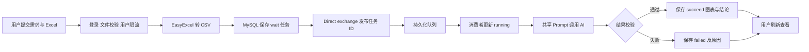

# 使用与实现说明

本文说明“AI 数据分析与可视化平台”当前版本，界面设计参照图片管理与协作平台；技术实现沿用并完善原 BI 工程，不迁移为图库项目的 Vue 技术栈。上游来源见 [项目首页](../README.md)。

## 使用流程

1. 打开 [登录页面](http://localhost:8000/user/login)，通过注册入口创建自己的账号，再登录。
2. 在“新建分析”填写分析需求，例如“分析各月销售额趋势，并指出变化明显的月份”，选择图表类型并上传真实 Excel。
3. 提交后进入“我的分析”，主动刷新查看状态。任务可能经历“等待中”“执行中”，最终显示成功结果或失败原因。
4. 成功任务展示图表及分析结论；需要在当前页等待返回时可使用“即时分析”。
5. 从头像菜单退出会话。产品不提供虚构的演示图表或成功结论。

当前 AI 禁用时，以上提交会得到明确失败反馈；异步任务可以用于观察真实队列消费与失败落库。不能将此结果解释为 AI 分析成功。服务配置和启动方法见 [运行说明](../local-runtime/README.md)。

文件要求：非空、最大 1 MB、扩展名 `.xls` 或 `.xlsx`，支持大写扩展名。工作表须包含表头和至少一行有效数据，列名应清晰，数据结构保持规整。后端会实际解析工作簿，修改文件后缀不会绕过内容校验。每个用户每秒最多获取 2 个分析提交许可，超限时稍后重试。

## 默认异步链路



前端默认入口调用 `/chart/gen/async/mq`。接口先保存任务，消息只携带任务 ID，消费者从数据库取得分析目标、图表类型和 CSV。图表与结论仍保存在 MySQL。即时分析和线程池异步接口保留，默认产品流程使用 MQ。

## 技术描述与代码对应

后端源码根目录为 `yubi-backend-master/yubi-backend-master/src/main/java/com/yupi/springbootinit/`。

| 机制       | 主要代码                                                                                   | 可以准确描述的行为                                                         |
| ---------- | ------------------------------------------------------------------------------------------ | -------------------------------------------------------------------------- |
| 文件校验   | `utils/ChartFileUtils.java`                                                                | 统一大小、空文件、大小写扩展名规则                                         |
| Excel 处理 | `utils/ExcelUtils.java`                                                                    | EasyExcel 读取实际工作簿；保留列位置；CSV 转义逗号、引号及换行             |
| 用户限流   | `manager/RedisLimiterManager.java`、`controller/ChartController.java`                      | 使用包含用户 ID 的限流键，通过 Redisson `RRateLimiter` 获取许可；每秒 2 次 |
| 任务状态   | `model/enums/ChartStatusEnum.java`、`controller/ChartController.java`                      | 统一 `wait`、`running`、`succeed`、`failed` 状态及异常记录                 |
| MQ 拓扑    | `config/BiMqConfig.java`、`bizmq/BiMqConstant.java`                                        | Direct exchange、持久化队列、固定 routing key；启动时声明                  |
| 消息与消费 | `bizmq/BiMessageProducer.java`、`bizmq/BiMessageConsumer.java`                             | 发布任务 ID，设置持久化消息；手动 ack/nack；异常路径记录失败               |
| Prompt     | `utils/ChartPromptUtils.java`                                                              | 同步、线程池异步与 MQ 共用输入和输出约定                                   |
| AI 边界    | `manager/AiManager.java`、`utils/ChartResultUtils.java`                                    | 禁用开关、模型配置、上游响应检查、严格 JSON 图表对象和非空结论解析         |
| 前端稳定性 | `src/pages/User/`、`src/pages/AddChart/`、`src/pages/AddChartAsync/`、`src/pages/MyChart/` | 提交期间锁定、失败恢复、统一文件规则、结果安全解析与手动刷新               |

共享 Prompt 组合分析目标、图表类型、CSV 和输出格式约定，模型输出使用 `【【【【【` 分隔图表 JSON 与分析结论，不接受可执行 JavaScript 代替 JSON。结构校验只证明返回格式可处理，不能证明模型分析结论准确。

## RabbitMQ 的边界

本地拓扑为 `bi_exchange` → `bi_routingKey` → `bi_queue`。队列声明为 durable，消息显式使用 `MessageDeliveryMode.PERSISTENT`。消费者以 MANUAL 模式确认，每条业务处理路径只选择一次 ack 或 nack；确认操作异常向容器传播，避免在同一业务捕获块中再次确认。

为兼容既有实例，exchange 仍沿用非 durable 声明；应用启动时会重新声明。不能直接对同名 exchange 改 durable 标志，否则现有 RabbitMQ 会拒绝不一致声明。

当前失败消息 `basicNack(..., false, false)` 不重新入队，没有配置死信队列或自动重试。尚未实现发布确认、数据库与消息提交的事务一致性、任务消费幂等或故障恢复调度；数据库不可用时失败状态本身也可能保存不成功。因此当前并不构成“零丢失”“恰好一次”或生产级可靠交付保证。

## 页面与工程整理

- 页面统一为“AI 数据分析与可视化平台”，采用蓝绿色浅色工作台、本地 SVG 标识和响应式布局。
- 登录与注册使用清楚的字段提示和提交反馈；退出调用服务端注销，减少仅清理页面状态造成的会话残留。
- 默认导航为“新建分析”“即时分析”“我的分析”“使用说明”，移除不可用模板入口与推广链接。
- 历史图表 JSON 损坏时，单张卡片显示提示；成功结果同时呈现图表与分析结论。
- 上游作者、模板说明和源码署名保留在文档及源代码中；不把教学项目基础能力表述为个人从零原创。

## 验证方式

前端使用 Node.js 18，在前端目录运行：

```powershell
npm test -- --runInBand
npm run tsc
npm run lint:js
npm run build
```

现有 Jest 回归关注登录与请求配置、文件校验、提交失败后恢复、新入口及任务渲染。全项目 `lint:prettier` 脚本带 `--write`，如需检查本轮格式，应只对修改文件执行 Prettier `--check`，避免无关代码变化。

后端使用 JDK 17 + Maven。`src/test/java` 中存在原始依赖外部服务的示例测试，当前隔离回归应按测试类选择运行；验收由主流程、文件处理、消息消费、配置和 AI 边界相关测试组成。不要将“跳过测试的 package 成功”作为回归通过证据。

在 `local-runtime` 中运行 `verify-services.ps1` 可验证真实 MySQL、Redis、RabbitMQ；`verify-app.ps1` 检查真实注册、登录、会话、图表查询和前端入口。仅在 AI 明确禁用时，运行 `verify-app.ps1 -VerifyDisabledAi` 观察线程池与 MQ 的失败落库；它会保留两条标记为联调用途的任务。

2026-10-01 的开发环境历史记录为：后端 94 项隔离回归、前端 57 项回归通过；TypeScript、ESLint、定向格式检查和前后端构建通过。该结果不代表发布副本在新机器上已复验。历史摘要与复验命令见 [验收记录](verification/README.md)，原始日志和含账号信息的截图不随源码发布。

## 演示与项目介绍

建议演示注册登录、Excel 提交校验、异步状态与失败提示、我的分析搜索刷新，再结合代码解释限流、状态流转和消费确认。待 AI 接口恢复可用后，补充真实成功任务和图表截图。勿将手工或模拟数据当成已接通服务的证据。

可按实际参与范围说明：“基于智能 BI 教学项目进行二次开发，围绕 Excel 到图表的主流程完善文件校验、异步任务状态和失败处理；采用 Redisson 用户级限流与 RabbitMQ 异步消费，整理统一 Prompt 和响应格式校验，并完成隔离本地服务联调与回归验证。”是否使用第一人称以及哪些部分属于个人完成，应由实际经历决定，不填入未测得的吞吐、延迟或提升比例。
